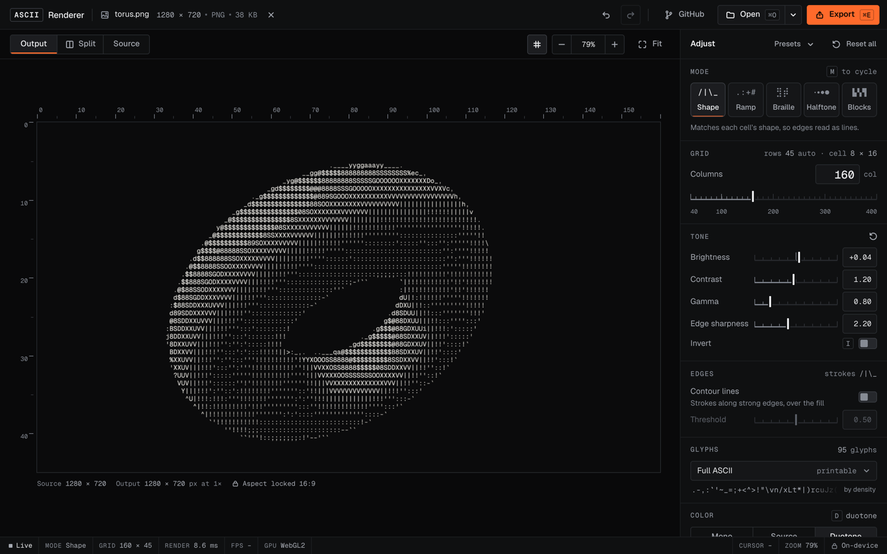

# ASCII Renderer

Turn images, GIFs, video and webcam input into ASCII art, live in the browser. Every control redraws the frame on the GPU as you drag, and files never leave your device.



## Features

- Live preview while you edit, rendered with WebGL2
- Five render modes: Shape, Ramp, Braille, Halftone and Blocks
- An optional edge layer that draws contour strokes over the fill
- A split view that compares the render with the original or with a plain brightness ramp
- Video and GIF playback with trimming and a stability control that stops glyphs flickering
- Export to PNG, SVG, TXT, HTML, GIF, MP4 and WebM at the source's aspect ratio
- Mono, source colour and duotone, in two UI themes
- Settings links that recreate a look

## How it works

Most ASCII converters map each cell's brightness to a character. Shape mode instead describes every cell by the lightness inside six sampling circles and picks the glyph with the closest profile, so diagonal edges become `/` and `\` instead of a smear of `#`. This follows Alex Harri's [ASCII characters are not pixels](https://alexharri.com/blog/ascii-rendering). The renderer adds exact area-weighted sampling and a distance that weighs shape by how much structure a cell has, and it runs in a fragment shader. A TypeScript CPU implementation produces the same output and backs the tests.

Every output shares one cell geometry, derived from the font's measured advance and line height. The preview, PNG, SVG, HTML, TXT, GIF and video therefore all keep the source's aspect ratio to within half a row. GIF export runs in a worker. Video export decodes, renders and encodes frame by frame with WebCodecs, so the output matches the source's frame timing and keeps its audio.

More detail is in [docs/ALGORITHM.md](docs/ALGORITHM.md) and [docs/ARCHITECTURE.md](docs/ARCHITECTURE.md). The design spec and tokens are in [docs/design](docs/design).

## Getting started

Requires Node 22 or later.

```bash
npm install
npm run dev        # http://localhost:5173
npm test           # unit tests
npm run test:e2e   # browser tests, run in your installed Chrome
npm run build      # static site in dist/
```

The build is a static site with no server component, hosted on Vercel.

## Project structure

```
src/engine   WebGL2 renderer and CPU reference
src/media    image, GIF, video and camera decoding
src/export   PNG, SVG, TXT, HTML, GIF and video export
src/ui       React components, with state in src/state and app logic in src/app
docs/        algorithm, architecture and design notes
legacy/      the original Python version
```

## Background

This began as a small Python tool I built for my own use, kept in `legacy/` for reference. The browser version is a rewrite with live GPU rendering, video support and exports that keep the source's proportions.

## Credits

- Rendering method: [Alex Harri](https://alexharri.com/blog/ascii-rendering). Edge layer: after [Acerola's ASCII shader](https://github.com/GarrettGunnell/AcerolaFX).
- Fonts: JetBrains Mono, IBM Plex Mono, Geist and Geist Mono (SIL Open Font License).
- Libraries: [Mediabunny](https://github.com/Vanilagy/mediabunny) (MPL-2.0), [gifenc](https://github.com/mattdesl/gifenc) and [gifuct-js](https://github.com/matt-way/gifuct-js) (MIT).
- The sample media is generated by `scripts/make_samples.py`.

## License

[MIT](LICENSE)
