## Background

In March 2026, I was rebuilding my portfolio and decided to add a few design elements to it that would reflect my engineering background and my enterprise AI experience.

I had recently seen a cool animation drawn entirely in ASCII characters on [Cognition](https://cognition.ai)'s then-homepage, and that stayed with me. It was maybe the first time I had seen ASCII art move this smoothly, which made me curious about how Cognition had done it and how ASCII art is made in general.

<!-- Image to add: Cognition's old homepage animation -->

That curiosity led me to Alex Harri's [ASCII characters are not pixels](https://alexharri.com/blog/ascii-rendering). It references the same Cognition animation, though through a different lens than mine, and highlights how the animation isn't even the best implementation of ASCII rendering. He explains that most ASCII art is made by splitting an image into a grid and picking an ASCII character for each cell of the grid by its brightness. The brighter the cell, the denser the character.

He also points out that with this method, the characters in Cognition's animation follow the edges of its cube logo poorly, so they look blurry and jagged. That's because each character is treated like a pixel, picked only for how dense or sparse it looks, and its shape is ignored. His approach is to pick characters by their shape.

I recommend reading Alex Harri's piece for a better understanding of how ASCII rendering usually works and how it can be improved. Reading it piqued my interest, and I thought that if I could recreate something like it, that would be the cool element I was looking for on my portfolio.

I searched online for any existing renderers, but couldn't find anything solid that would let me achieve what I had in mind. So I decided to go the extra mile and make one for myself.

## The initial build

I quickly vibe-coded a hacky web app with Claude Code, and as a result, a good part of it was AI slop.

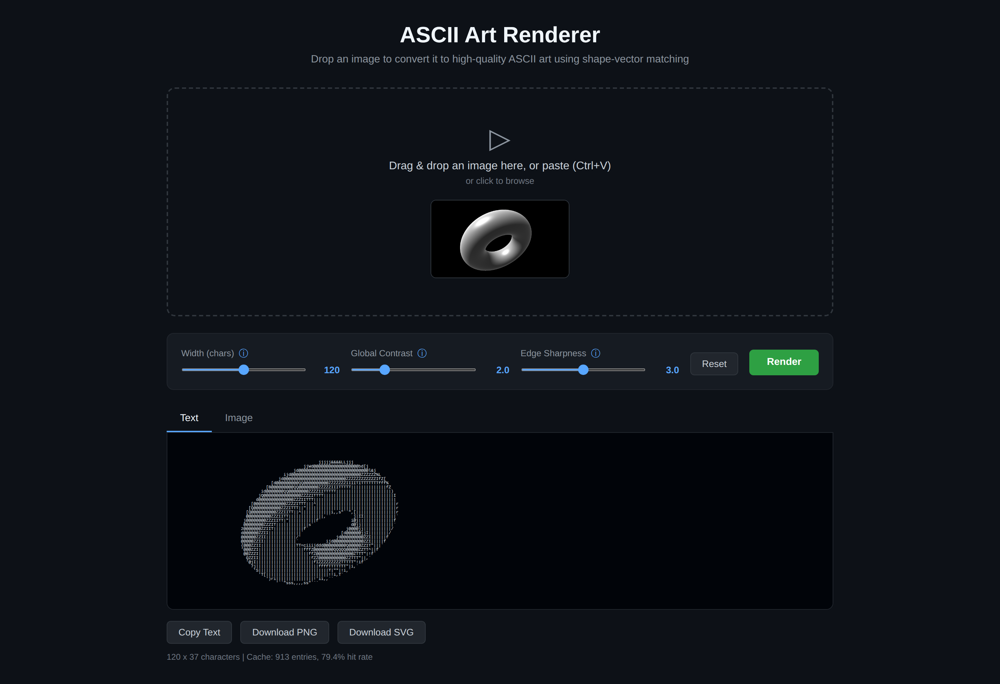

It was a small Python app with a drop zone to upload an image, a few parameters to configure and a Render button that converts the image to the ASCII render. It followed the article's approach closely, and the results were good enough to get me excited.

But it had its shortcomings. The PNG and SVG exports never came out right, so if I wanted to use a render in a design, I had to copy the ASCII text, paste it into Figma and process it there before I could use it. I also tried adding GIF support, but it didn't work, so I never followed through with it.

I did come up with a design using this technique, but I wasn't satisfied with it, so I left the idea and the app there.

<!-- Image to add: Figma hero section variant with the ASCII art design -->

The portfolio got built without it, and I moved on.

## Going all the way

Cut to October 2026. I had a long weekend ahead of me, and I decided to come back to this project, treat it like a hackathon and go all the way. By then, I had a lot more [design engineering](https://mihirbatra.in/work/artemis) behind me, and I could identify the AI slop and steer around it.

I went in with a hypothesis that I could skip Figma entirely and use Claude Design instead for exploration and design.

## Designing without Figma

I wanted the new app to have the look and feel of some of the dev tools I enjoy using, like Vercel, Cursor and Linear.

It had to be simple enough that anyone could drop a file in and get the output they wanted, and deep enough for someone who wants to play around and tweak every setting.

I went for a clean, technical look without any gradients, glows or glass effects. Dark graphite theme with thin lines and a bright orange accent. Keyboard shortcuts cover the whole app, and a status bar shows stats for nerds.

<!-- Image to add: Claude Design canvas showing the design system and component map -->

All of it was designed in Claude Design, through conversation and on its canvas, without opening Figma once.

## The ASCII renderer

After two days of burning tokens and exhausting the full weekly limit of my Max 20x plan, I built a solid app that fixed the initial build's limitations and went well past them.

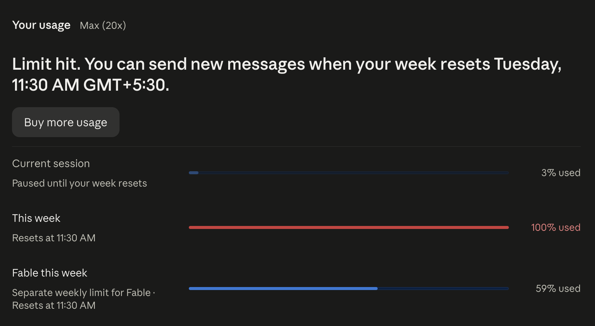

### Fixing the initial build

Upon investigation, I found that the initial build sized each character by how big the letter M looked, instead of the font's real character width and line height. That made every exported image noticeably wider than the original. I fixed this by measuring the font once and building every export from one shared grid, so the aspect ratio is preserved in exports.

Other than this, the initial build couldn't render GIFs or video, and the renders were painfully slow, since everything ran in Python on the CPU. I moved the whole pipeline to the GPU. Now the preview updates in real time as you modify the parameters, and GIFs and videos play and export at their original speed.

The characters also didn't quite match the image. The initial build drew each character centred in its cell instead of on the font's baseline, so `.`, `-` and `_` lost the position that tells them apart. It also measured characters and images in slightly different ways. Now every character sits on its real baseline and is measured exactly like the image.

### A new start screen

The new app opens with a redesigned homepage. You can now render ASCII art from an image, GIF or video file on your device, in the clipboard or at a link, and even use your device's live camera feed. You can also simply drag the file you want to convert and drop it in the drop zone.

If you want to get started quickly, there are a few samples to select from just below the drop zone. Click on one and that's it. The sample opens in the editor with its settings already applied.

The footer notes that everything is processed in the browser, and the files you open stay on your device.

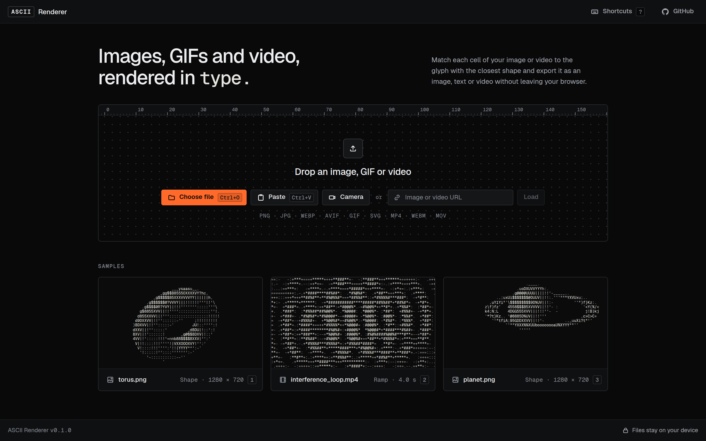

### Live preview and precise controls

The editor keeps the focus on the live preview. The controls sit in a panel on the right, grouped into sections for the mode, grid, tone, colour and more. To keep the panel easy to scan, each control shows only its label and value, and hovering over a label shows a tooltip explaining what it does. On a phone, the modes sit along the top and the controls move into a sheet under the preview.

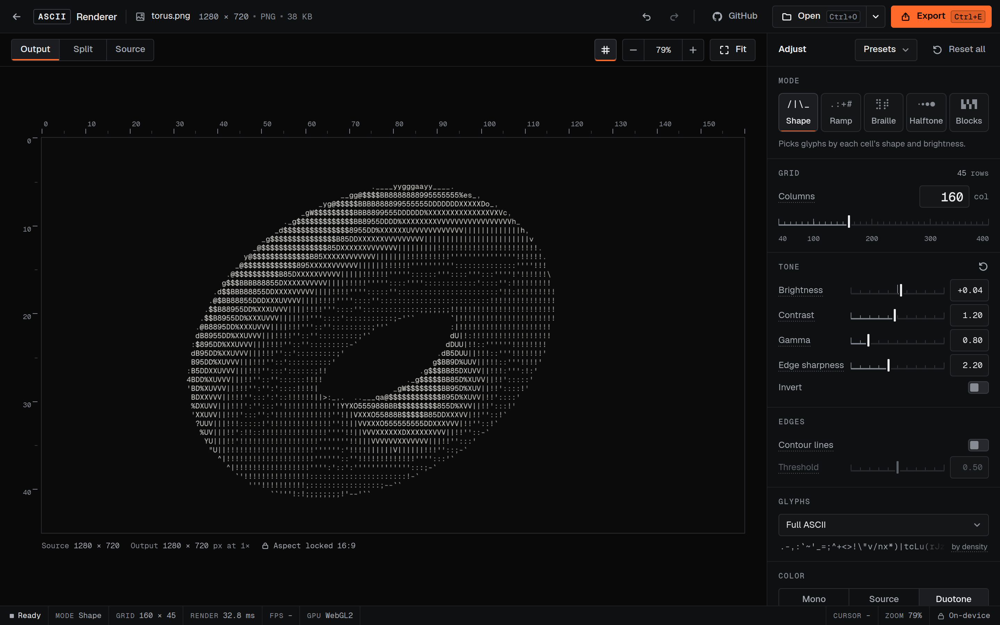

Rulers along the top and left of the preview count columns and rows. Hovering over a cell shows its column and row, the character in it and its brightness. The status bar at the bottom shows the grid size, how long each frame takes to render and the frame rate, so these details are always visible.

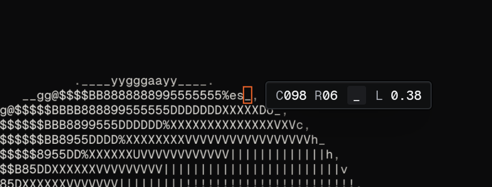

The Split view compares the render with the source image, or with a plain brightness-only render of the same image. Every change can be undone and redone.

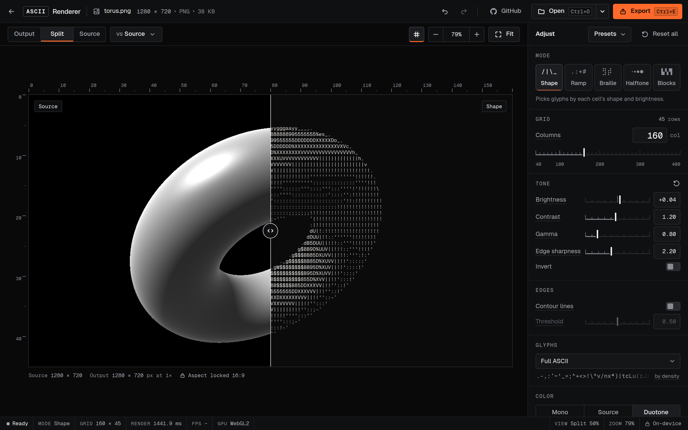

GIFs and videos also get a timeline for scrubbing through the clip, stepping through it frame by frame, trimming it with In and Out points, looping it and changing its speed.

### Five modes and colour

The app has five modes to switch between.

<!-- Interactive component: the five mode tiles from the app, with their icons. Selecting a tile shows that mode's render and description. The five renders and descriptions below are its content. -->

**Shape.** Picks each character by both brightness and shape, so characters follow the edges.

**Ramp.** Picks characters by brightness alone, from the classic ramp of characters sorted from sparse to dense.

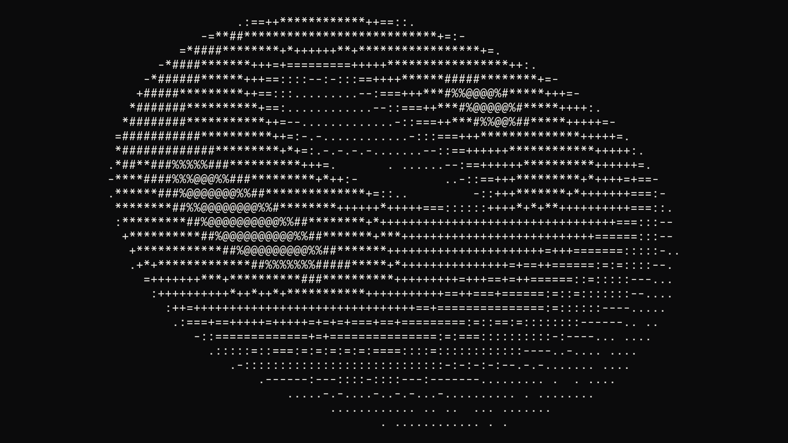

**Braille.** Splits each cell into a 2 × 4 grid of braille dots, and every character carries eight dots of detail.

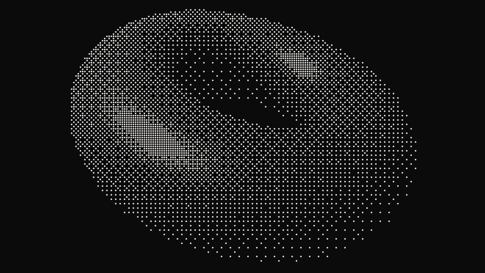

**Halftone.** Draws a grid of dots, rotated 45° the way print halftones are, with each dot sized by the brightness under it. The dots can also be squares, diamonds or lines.

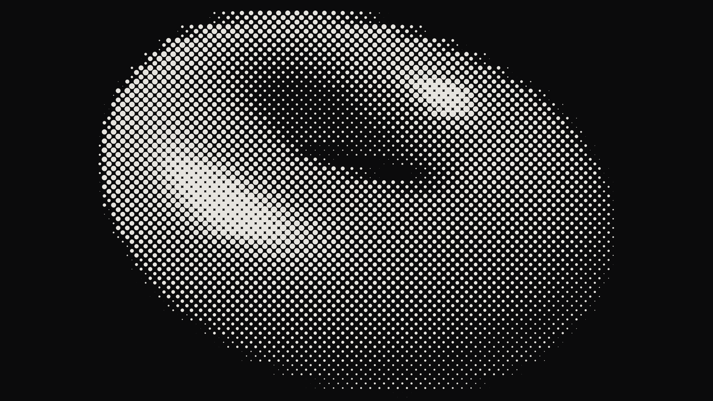

**Blocks.** Splits each cell into 2 × 2 quarter blocks.

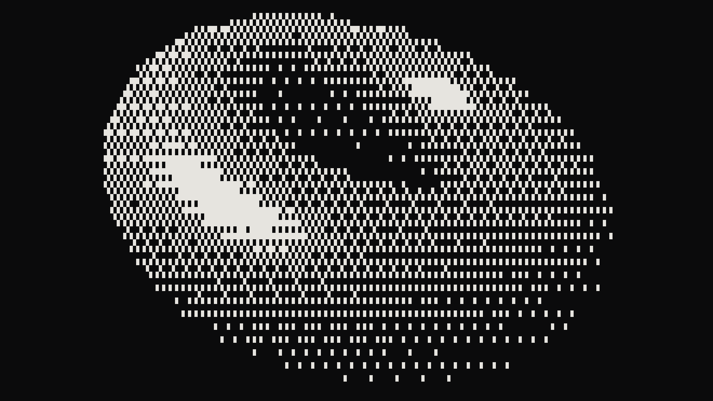

The app comes with built-in presets for Line art, Soft photo, Braille dots, Halftone print and Teletext. You can also save your own.

Every mode also works in three colour themes. Mono uses one ink for the whole render, Source takes each cell's colour from the image, and Duotone blends two inks based on brightness.

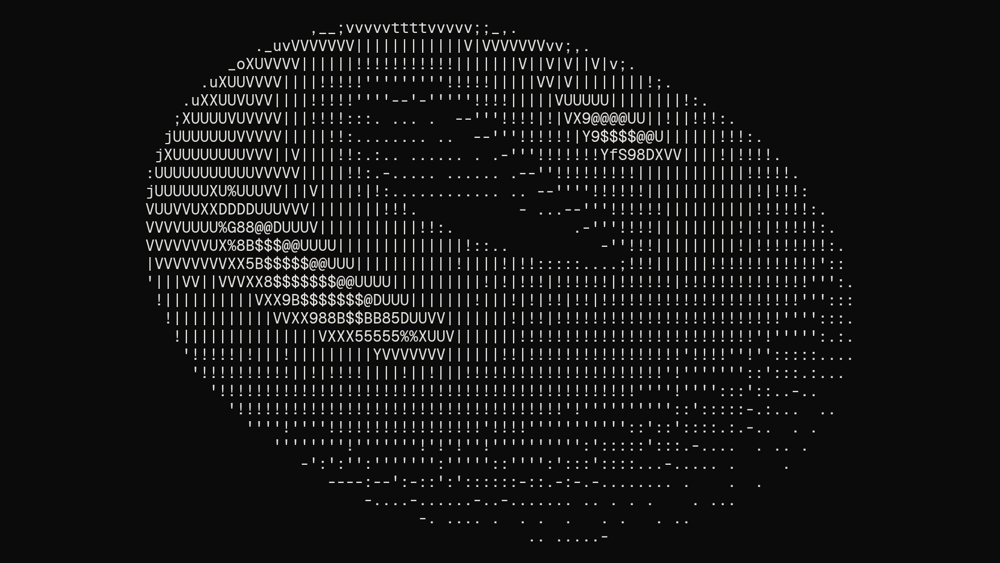

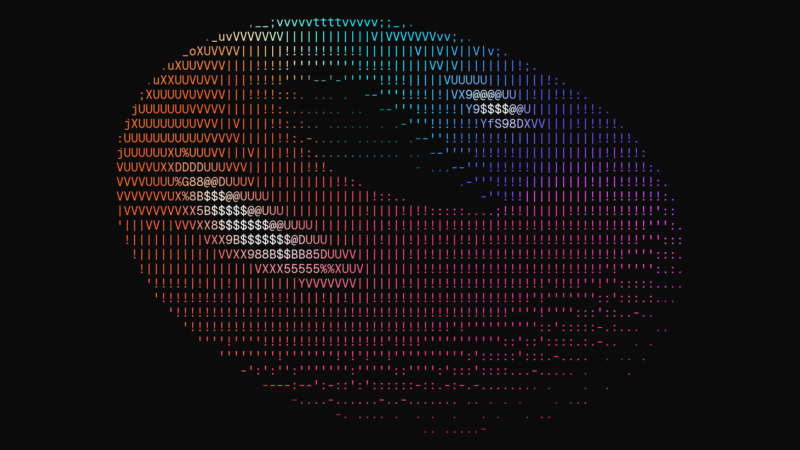

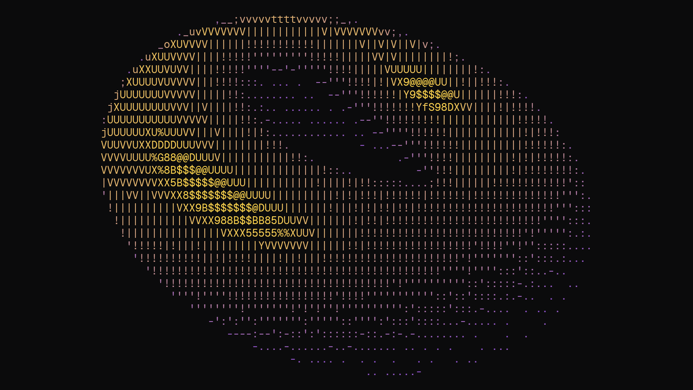

### Exports and sharing

You can export your ASCII render as PNG, SVG, TXT, HTML, GIF, MP4 or WebM. GIF and video exports keep the clip's frame timing, MP4 and WebM formats keep its audio too, and the webcam can be recorded straight to video.

The PNG, the SVG and the text can also be copied straight to the clipboard, ready to paste wherever you need them.

### Accessibility

Keyboard shortcuts cover the whole app, and pressing the "?" key shows all of them in one modal. When you move through the app with the keyboard, the focused control has an orange outline.

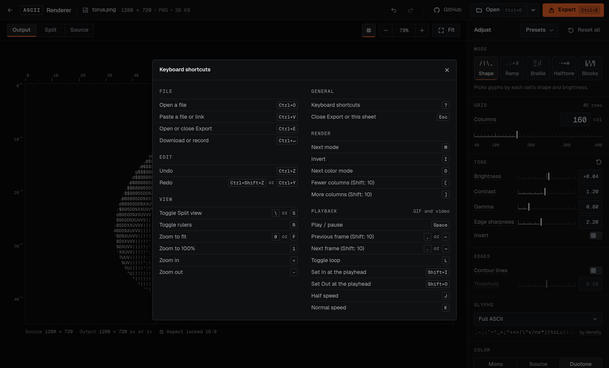

All text meets the WCAG contrast minimum of 4.5:1 against the dark theme, including the dimmest labels, and every button and slider has a hit area of at least 32 pixels. All buttons have labels for screen readers and tooltips that show their shortcut. States are not shown by colour alone. Selected items also have a bar and a border, and disabled options include clear reasoning.

For screen readers, the preview has a text label with the file name and grid size, for example "ASCII render of torus.png, 160 by 45 cells", and actions like switching modes or Undo are announced. For the systems set to reduce motion, the app removes its sliding animations and the looping loading indicator.

## How it works

### Architecture

The app runs entirely in the browser. There's no server.

It has four main parts.

- **The media layer**, which reads files and the webcam, including every frame of a GIF or video.
- **The renderer**, which turns each frame into characters on the GPU, using WebGL2.
- **The exporters**, which turn the result into files.
- **The interface**, which sits on top.

The preview and every export come from the same grid. This is what fixed the aspect ratio bug from the initial build. The preview is drawn by the same code that draws the exports, so what you see is what you download. And since there's no Render button, every change redraws the preview on the next frame.

Long exports like GIF and video are encoded in the background, so the app stays responsive and you can cancel them at any point. For browsers without WebGL2, a slower copy of the renderer runs on the CPU.

### Algorithm

The app cuts the image into a grid of cells. Instead of measuring each cell's overall brightness, it reads six small circles inside the cell. Together, the six readings capture the cell's brightness and shape, which the app uses to pick the right ASCII character.

This works a lot like word embeddings, the vectors language models use to place words with similar meanings close together. The six readings form a six-dimensional vector for each cell, and every character in the font gets one too. Picking a character is then a nearest-neighbour search using a weighted Euclidean distance, the same kind of vector search that retrieval in RAG systems is built on.

Read more about the [architecture](https://github.com/mihirbatra-23/ascii-renderer/blob/main/docs/ARCHITECTURE.md) and the [algorithm](https://github.com/mihirbatra-23/ascii-renderer/blob/main/docs/ALGORITHM.md) in the project's notes on GitHub.

### What I changed from Harri's approach

In the initial build, I followed Harri's approach almost line for line. The new app keeps the idea but changes three things around it.

**Matching every cell exactly.** Comparing every cell with every character was too slow on a CPU, so Harri sped it up with a faster search and a cache that rounds each reading. That cache caused bugs in the initial build, where it picked the wrong character for 5 to 32% of cells. The new app compares every cell with every character on the GPU, where it's fast enough, so it always picks the closest character.

**Keeping tone in flat areas.** A flat grey cell has no shape, so only characters with evenly spread ink could match it, and smooth areas filled up with `|` and `!`. The new app gives shape less weight when a cell has little shape of its own, so edges are matched as before and smooth areas keep their tone.

**Keeping the ramp.** Harri's article moves past the classic brightness ramp, `.:-=+*#%@`. I kept it as Ramp mode, because it suits some soft photos, and next to Shape in the Split view, it shows the difference shape matching makes.

## Reflection

Most of my other design engineering projects feel like apps that I designed and happened to build. This one feels like an app that I built and happened to design.

### Know enough to steer

I built both versions with the same exact tool, following the same idea and approach. The difference between them was the level of understanding and control I had. With the initial build, I followed Harri's approach directly and took Claude's output as it came. With the new app, I knew enough to question both.

### Testing the hypothesis

My hypothesis held. I skipped Figma entirely and used Claude Design for both exploration and design. Working only in Claude Design felt weird at first, because I didn't have the manual control and tooling I was used to in Figma. But it also freed me from the manual work, which I could now rely on Claude for, as long as I gave it the right ideas and feedback.

> **Fun fact**
>
> The ASCII animation at the top of this page was rendered in the app itself. In a way, it's the kind of element I set out to add to my portfolio in the first place.

## Further reading

- [ASCII characters are not pixels](https://alexharri.com/blog/ascii-rendering) by Alex Harri. The article this project is based on. He explains the subject really well using examples and interactive demos.
- [Architecture notes](https://github.com/mihirbatra-23/ascii-renderer/blob/main/docs/ARCHITECTURE.md) on how the app is put together, from reading a file to exporting it.
- [Algorithm notes](https://github.com/mihirbatra-23/ascii-renderer/blob/main/docs/ALGORITHM.md) on how the renderer picks each character, with every constant and the measurements behind each change.
