## Background

Earlier this year I started rebuilding my portfolio, and I wanted a few small elements on it that would reflect my engineering background and my enterprise AI experience.

One idea had been on my mind for a while. I had seen a cool animation drawn entirely in ASCII characters on [Cognition](https://cognition.ai)'s then-homepage. This was maybe the first time I had seen ASCII art move this smoothly. I had decided right then that I would make something like it for my portfolio when I rebuilt it, and now was the time to act on it.

I first searched online for a tool that could do it for me, but I couldn't find anything that was reliable or would let me achieve the results I had in mind. So I started digging into how Cognition had done it, and into how ASCII art is made in general.

That led me to Alex Harri's [ASCII characters are not pixels](https://alexharri.com/blog/ascii-rendering). It references the same Cognition animation, though through a different lens than mine, and highlights how the animation isn't the best implementation of ASCII rendering. He mentions that the characters follow the edges of Cognition's cube logo poorly, so they look blurry and jagged. That's because each character is treated like a pixel, picked only for how dense or sparse it looks, and its shape is ignored. His approach is to pick characters by their shape, so that edges come out as lines.

That piqued my interest, and it is what made me go the extra mile on this project.\
I recommend reading Alex Harri's piece for a better understanding of how ASCII rendering usually works and how it can be improved.

## The first build

My first version, v0, was a hacky, vibe-coded web app I made with Claude, and a good part of it was AI slop. It was a small Python app with a drop zone, a few sliders and a Render button. It followed the article's approach closely, and the results were good enough to get me excited.

*v0, running again from the repo for this page.*

The exports were where it fell apart. The PNG and SVG files never came out right, so every time I wanted to use a render in a design, I copied the ASCII text, pasted it into Figma in the right font, and turned it into an SVG or an image from there.

I left it there. Neither Claude nor I knew enough yet to fix the exports, and the video support I had planned never happened. I did design a variant of my portfolio's hero section in Figma using the tool's output, but it never made the cut.

The portfolio got built without it, and this went into my backlog.

## Going all the way

Cut to October 2026. The portfolio had been built, and I had a long weekend with nothing better to do. I decided to come back to this project and go all the way. By then, I had a lot more [design engineering](https://mihirbatra.in/work/artemis) behind me. This time I could tell the AI slop apart from the parts worth keeping and steer around it, and I ended up building v1, a solid app that fixed v0's limitations and went well past them.

I went in with a hypothesis: I would treat this rebuild like a hackathon, skip Figma entirely, and use Claude Design instead for exploration and design.

The first job was fixing v0:

- **Squashed exports.** v0's PNG export sized each character by how big the letter M looked, not by the font's real character width and line height, so a 16:9 image came out noticeably wider. I fixed this in v1 by measuring the font once and building every export from one shared grid, so all seven formats keep the original aspect ratio.
- **Everything else.** v0 couldn't open video, renders were slow, and GIFs flickered a lot from frame to frame (when it worked). v1 plays and exports video, redraws the frame while you drag, and holds characters steady during playback.

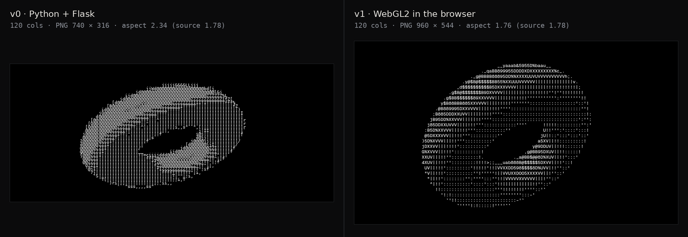

*The same torus at 120 columns. Left: v0. Right: v1.*

## Designing without Figma

The whole interface was designed in Claude Design, through conversation and on its canvas, without opening Figma once.

I wanted it to have the look and feel of some of the dev tools I enjoy using: Vercel, Cursor, Linear and Agno, which I had tried just once and which, to my surprise, left a mark with its design.

It had to be simple enough that anyone could drop a file in and get the output they wanted, and deep enough for someone who wants to play around and tweak every setting.

I designed it like a precision instrument. It relies on hairline rules and graphite chrome rather than gradients, glows or glass, with a single bright orange accent. No Render button. Every preview is real-time engine output. Keyboard shortcuts cover moving through the app, and a status bar shows nerd stats like render time and frame rate.

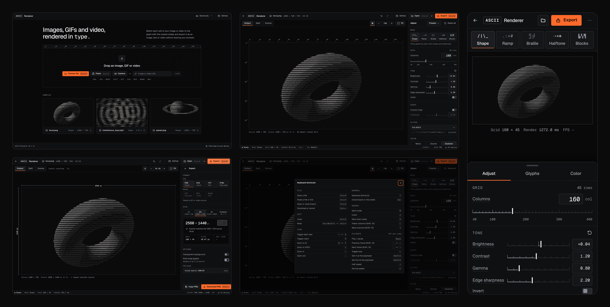

*The full interface: start screen, editor, export panel, keyboard shortcuts and the phone layout.*

## How it works

Shape, the app's main mode, works in five steps. Everything that runs per frame happens on the GPU, which is why the preview updates in real time.

**1. Cut the image into cells.** The app lays a grid over the image, one cell per character. The cell size comes from the font, so the output keeps the image's proportions.

**2. Read each cell with six circles.** Instead of measuring a cell's overall brightness, the app reads six small circles inside it, in the staggered two-by-three layout from Harri's article. Together, the six readings capture the shape of what's in the cell: whether it's heavier at the top or the bottom, on the left or the right.

**3. Read every character the same way.** Each character in the font gets the same treatment once, which gives it a six-number fingerprint. `T` is heavy at the top, `_` only at the bottom, `/` runs from one corner to the other, and `|` is nearly even across all six.

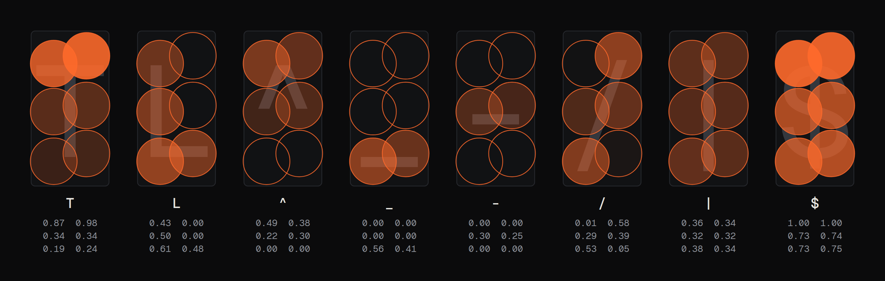

*Eight characters as the app sees them. Each circle's fill shows how much of it the character's ink covers, scaled so the inkiest character in each circle reads 1.00.*

**4. Pick the closest fingerprint.** For each cell, the app picks the character whose fingerprint is closest to the cell's six readings. Where an edge runs through a cell, the readings take on its shape, and the character that matches follows the edge.

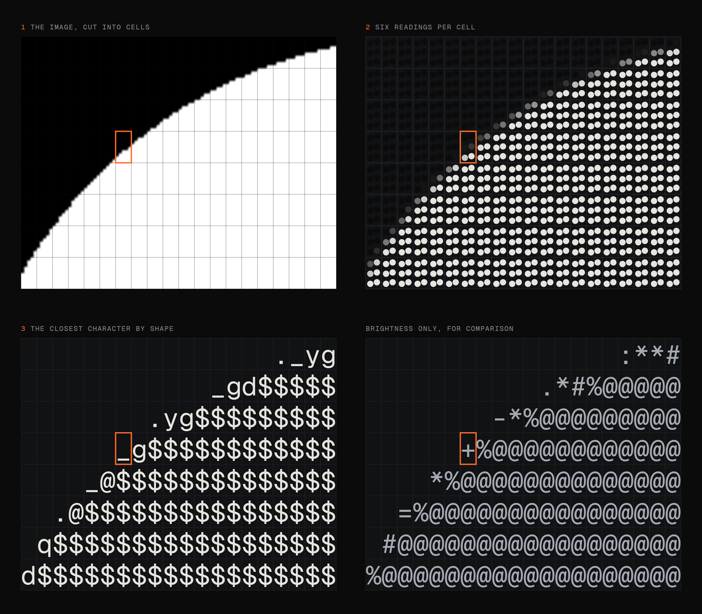

*The rim of a white circle at 80 columns, from the engine's own data. The highlighted cell is lit only in its bottom two circles, so Shape picks `_`. Brightness alone only knows the cell is partly lit, and picks `+`.*

**5. Sharpen, and keep it steady.** Before matching, the readings are exaggerated a little so boundaries come out crisper, partly by looking into the neighbouring cells. The Shape contrast and Edge sharpness sliders control how much. On video, a Stability control smooths each cell over time, so characters don't flicker between two close matches.

Harri points out the parallel to word embeddings, the lists of numbers AI models use to place similar words close together. A fingerprint like this is, in effect, an embedding of a character, and picking the closest one is a nearest-neighbour search, the same operation that retrieval in AI products is built on.

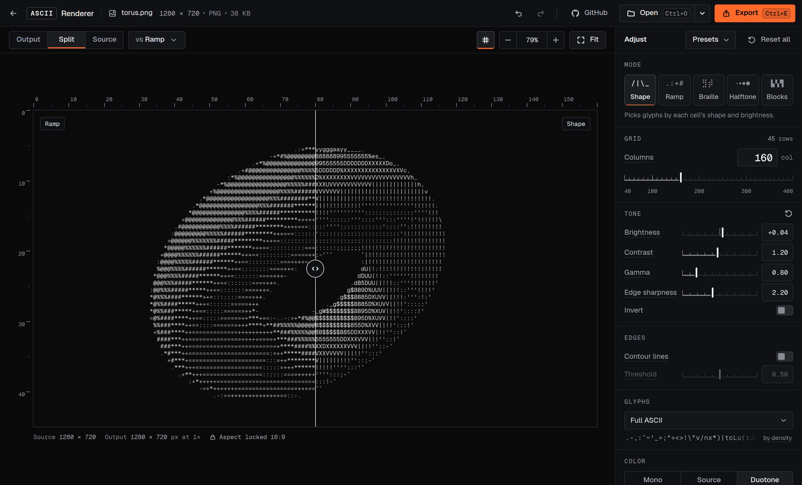

*The Split view compares Shape with a brightness-only render of the same image.*

## What I changed from Harri's approach

The idea is Harri's, and v0 copied his article almost line for line. v1 keeps the idea and changes some of the machinery around it. A few of those changes look like steps backwards on paper.

### Less clever, always right

Harri spends two appendices on speed. Comparing every cell with every character was too slow on a CPU, so he added a k-d tree to search faster and a cache that rounds each reading to a few levels, and he moved the sampling and contrast work onto the GPU. v0 copied the k-d tree and the cache, and the cache was behind its strangest bugs. Rounding sends many different cells to the same answer, and in v0 it picked the wrong character for 5 to 32% of cells. v1 does the matching on the GPU as well, where comparing every cell with every character is cheap. It is less clever, and it is always right.

### Flat areas keep their tone

v0 had one more problem, and it came from the matching itself. A flat grey cell has no shape, so only the few characters with evenly spread ink could win it, and smooth areas filled up with walls of `|` and `!`. v1 tells the matcher to care less about shape when a cell has little shape of its own. Edges match exactly as before, and smooth areas keep their tone. On one of my test images, `!` dropped from 61% of the inked cells to 35%.

### Keeping the ramp

The article starts from the classic brightness ramp, `.:-=+*#%@`, and spends the rest of its length moving past it. I kept it anyway, as Ramp mode. For soft photographs it is sometimes the look you want, and next to Shape in the Split view, it shows exactly what shape matching adds.

### Adding what a tool needs

Some things only matter once the renderer is a tool rather than a demo. An optional edge layer, borrowed from [Acerola's ASCII shader](https://github.com/GarrettGunnell/AcerolaFX), draws strokes along strong edges. Exposure is measured once per clip, so it holds still from frame to frame. And colour is an option, even though Harri leaves it out on purpose because he doesn't like the look.

## What it does now

Two days and the full weekly limit of my Max 20x plan later, here's what the app does.

### Any source

Images, GIFs, video files and a live webcam, all converted in the browser. Files never leave the device. Clips play on a timeline, where you can scrub through them and trim them before exporting.

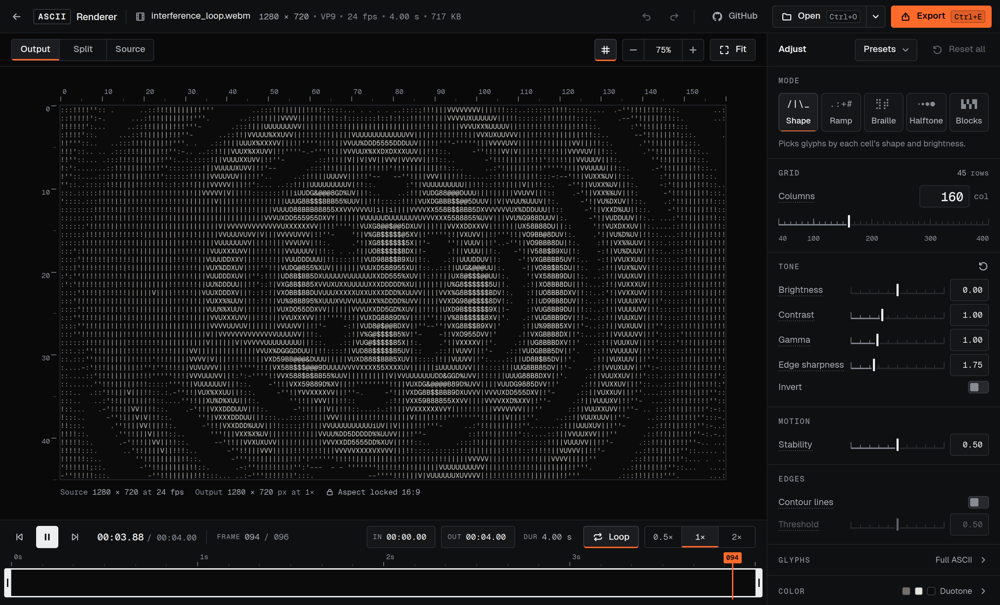

*A video clip in Shape mode, with trimming and playback controls along the bottom.*

### Five looks

The app has five modes, and all of them run on the same pipeline, so the tone and colour controls and every export format work in each. Below is the same torus at 160 columns in each look, in monochrome.

**Shape.** Picks each character by the shape of what's in its cell, so characters follow the edges. It's the look the whole project was built around.

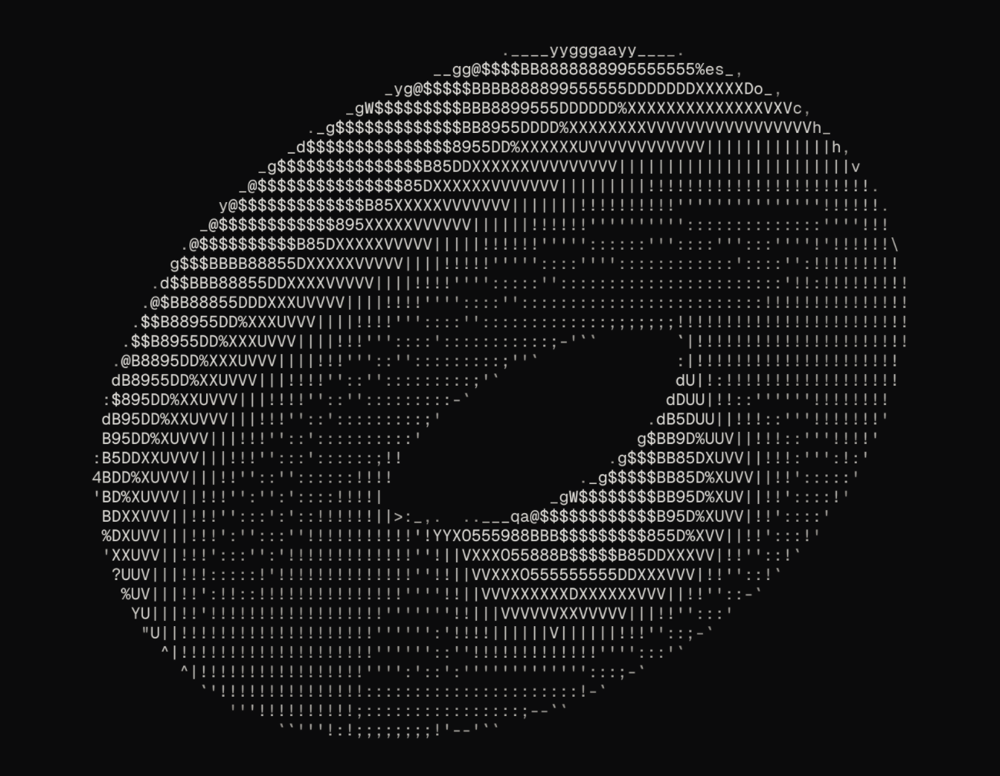

**Ramp.** Picks characters by brightness alone, from the classic ramp I kept from the article. One of the built-in presets, Soft photo, builds on it.

**Braille.** Splits each cell into a 2 × 4 grid of braille dots, so every character carries eight dots of detail. A dither pattern decides which midtone dots are on, and the dots are drawn rather than typed, so they stay sharp at any size.

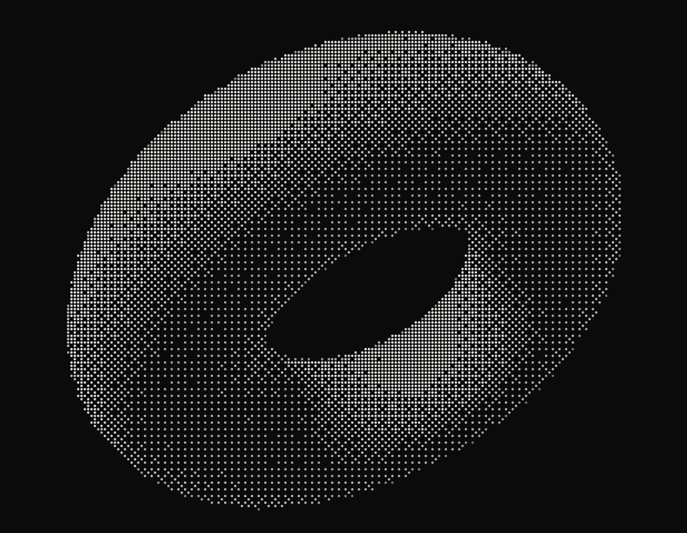

**Halftone.** Not text at all. It draws a grid of dots, rotated 45° the way print halftones are, with each dot sized by the brightness under it. The dots can also be squares, diamonds or lines.

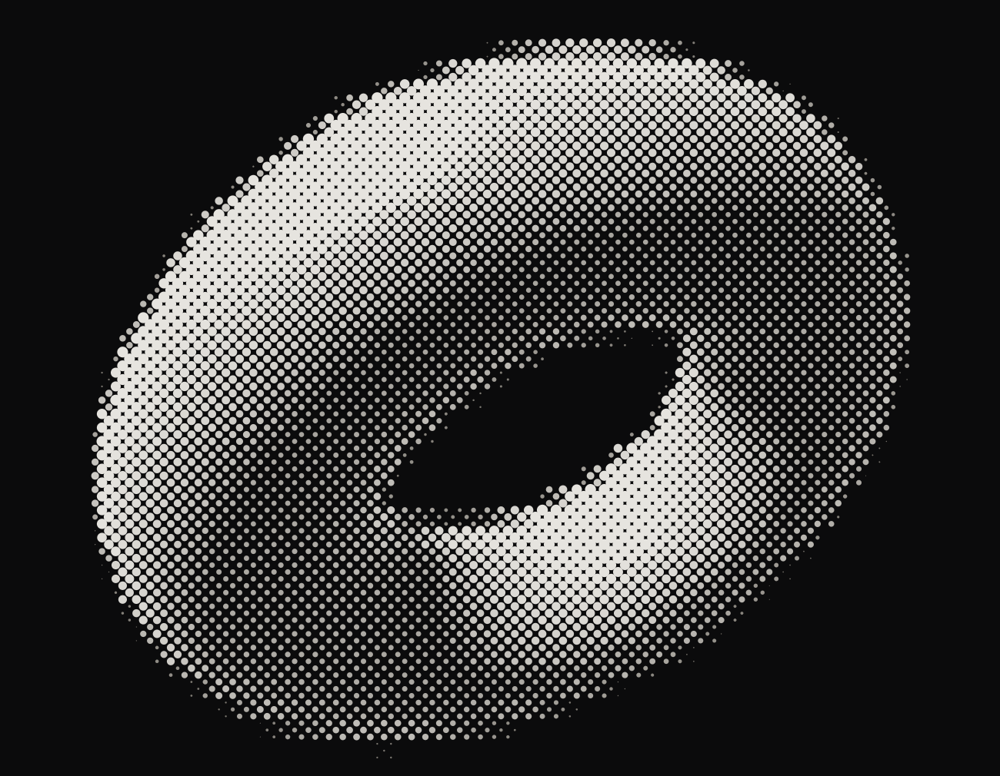

**Blocks.** Splits each cell into 2 × 2 quarter blocks. In the source's own colours, every cell picks the two that fit it best, which gives the render a teletext look. The built-in Teletext preset sets that up at 80 columns.

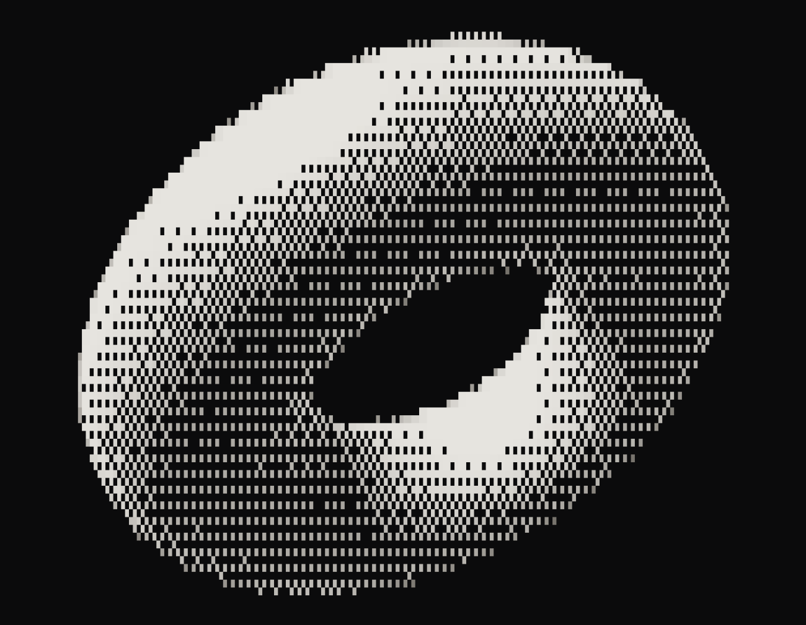

### Colour

There are three colour settings. Mono uses one ink, Source takes each cell's colour from the image, and Duotone blends two inks by brightness.

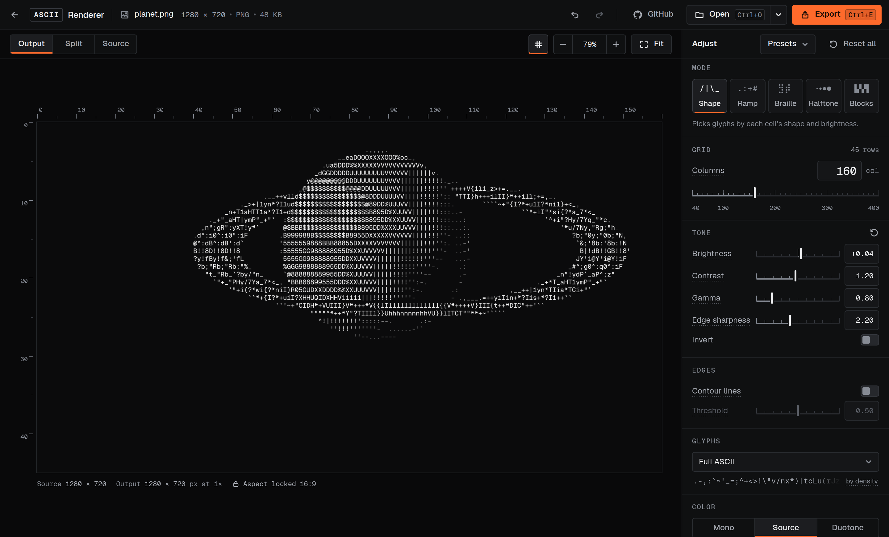

*A planet, one of the app's sample images, in Source colour.*

### Exports that match the preview

PNG, SVG, TXT, HTML, GIF, MP4 and WebM, all built from the same grid as the preview. Video exports keep their frame timing and their audio.

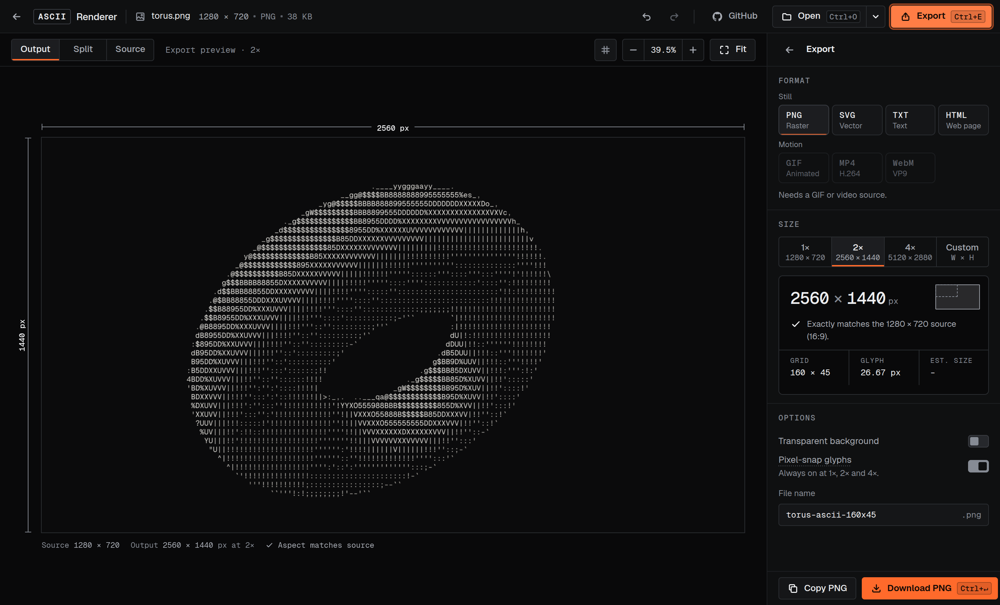

*The export panel previews the file at its final size and checks it against the source.*

### Room to experiment

The Split view compares the render with the original or with a brightness-only version. There's also undo and redo, five built-in presets plus your own, and settings links that recreate a look.

**[Try it live](https://asciirenderer.vercel.app/)**. Drop in an image and drag the sliders.

## Reflection

Some of my other projects feel like apps I designed and happened to build. This one feels like an app I built and happened to design.

### Know enough to steer

The idea and the approach are Alex Harri's, and I built both versions with Claude. The difference between them was how much I understood. With v0, I took the article's tricks and Claude's code as they came. With v1, I knew enough to question both, and the changes I'm surest of made the renderer less clever. Claude could write the code both times. Knowing which parts to keep was on me.

### Testing the hypothesis

I never opened Figma, and the hackathon scope held for about a day. After that I kept adding to it and refining the interface to the last pixel.

Designing only in Claude Design felt weird at first, because I didn't have the manual control and tooling that I had in Figma. But it also freed me from the manual work. I could rely on Claude for that, as long as I gave it the right ideas and feedback.

> **Fun fact**
>
> The animation at the top of this page was rendered by the app itself. An ASCII animation for my portfolio is what I set out to make in the first place.

## Further reading

- [ASCII characters are not pixels](https://alexharri.com/blog/ascii-rendering) by Alex Harri. The article this project stands on, with interactive demos for every step.
- [AcerolaFX](https://github.com/GarrettGunnell/AcerolaFX), whose ASCII shader the edge layer is modelled on.
- [The renderer's spec](https://github.com/mihirbatra-23/ascii-renderer/blob/main/docs/ALGORITHM.md), with every constant and the measurements behind each change.
